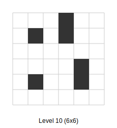

# Coil - Pathfinding Puzzle Game

Coil is a pathfinding puzzle game, where the objective is to traverse a grid-based maze while ensuring every tile is visited exactly once. The player starts at a designated position and must navigate using four-directional movement (up, down, left, right).

## Example Levels





## 1. Input Format
A game level consists of a rectangular grid of dimensions x×y (width × height). Each cell is either empty or a wall.

## 2. Objective
The goal of the game is to visit every non-wall cell.

## 3. Rules
You may pick any starting point that isn't a wall. Then you can move in any orthogonal direction: up, down, left, or right. When you start moving, you continue until you hit a wall, the edge of the board, or a previously visited square. At this point you pick a new direction, if you are not at a dead end. If every empty square has been visited, you win.

## 4. Format
The input format looks like this:
```
x=<x dimension>&y=<y dimension>&board=<series of characters representing the board>
```

The characters are a '.' for empty, and a 'X' for a wall. This starts in the upper left and progresses across the first row, then the second, etc.

An example of a 3x3 board:
```
x=3&y=3&board=X.......X
```

Which represents:
```
X . .
. . .
. . X
```

This is visualized in Level 1 above.

## 5. Solution format
Looks like:
```
x=<x>&y=<y>&path=<path>
```

x and y are the coordinates of the starting point.
Path is a series of characters between U for up, D for down, L for left, and R for right.

## 6. Example
For this board:
```
x=3&y=3&board=X.......X
```

There are multiple solutions, but one is to start at (1, 0), move right, then down, then left, then down, then right.

The solution would be then:
```
x=1&y=0&path=RDLDR
```

## 7. Evaluation

To test a solving program, we run a script that feeds the program with game levels one by one, then evaluates the results. If it passes the level, the evaluation script will proceed on to the next level. After each level we print the time taken and the result.

The programs read the level on standard in, and return the solution on standard out.

The evaluation script (evaluate.py) can be used as follows:

```
./evaluate.py <solver_program> [--start N] [--end M] [--timeout T] [--estimate] [--debug]
```

Where:
- `<solver_program>` is the path to your solver program
- `--start N` (optional) specifies the starting level number (default: 1)
- `--end M` (optional) specifies the ending level number
- `--timeout T` (optional) specifies the maximum time in seconds allowed for solving a level (default: 60)
- `--estimate` (optional) estimates solving times for larger square levels (100x100 to 2000x2000) based on the collected timing data, showing predictions from multiple models calibrated to the actual performance
- `--debug` or `-d` (optional) enables debug mode for solution validation, showing the board state when a solution fails

Example:
```
./evaluate.py ./my_solver --start 1 --end 3
```

This will test your solver against levels 1, 2, and 3, and report the results with level dimensions:
```
Level 1 (3x3): PASS (0.03s)
Level 2 (4x3): PASS (0.03s)
Level 3 (5x3): PASS (0.03s)
```

## 8. Visualization

To visualize a level file as a 2D grid, you can use the draw_level.py script:

```
./draw_level.py <level_file> [--output OUTPUT_FILE]
```

Where:
- `<level_file>` is the path to the level file
- `--output OUTPUT_FILE` (optional) specifies an output file to write to instead of stdout

Example:
```
./draw_level.py levels/1
```

This will display the level as a 2D grid with walls represented as █ and empty cells as dots.

The SVG visualizations above were generated from levels 1, 10, and 50, showing the increasing complexity of puzzles. Dark squares represent walls while empty cells are shown in white.

## 9. Example Solver

### Brute Force Solver (coil_solver.py)

```
./coil_solver.py [level_file]
```

Where:
- `[level_file]` is the path to the level file (optional, reads from stdin if not provided)

The solver uses a simple backtracking algorithm to try all possible starting positions and movement sequences. It will output the first valid solution it finds in the format specified in section 5.

Example:
```
./coil_solver.py levels/1
```

This will output a solution like:
```
x=1&y=0&path=RDLDR
```

## 10. Debugging

When a solution fails validation, it can be helpful to see what went wrong. The check program supports a debug mode that prints out the board state when a solution fails:

```
./coil_check/check -d <board_file> <solution_file>
```

The debug output shows:
- The current board state with:
  - `X` for walls
  - `#` for visited cells
  - `.` for empty cells
  - `@` for the current position
- The current position coordinates
- Information about what went wrong (e.g., "direction is blocked", "path misses N fields")

You can also enable debug mode in the evaluation script with the `--debug` or `-d` flag:

```
./evaluate.py ./my_solver --debug
```

This will show detailed debug information when a solution fails validation.

## 11. Victory

The top level to solve is approximately 2000 by 2000. A good solver will be able to solve this in under an hour.

Some clever approaches are needed because the time estimate for the simple solver is:
2000x2000: 304.41 millennia